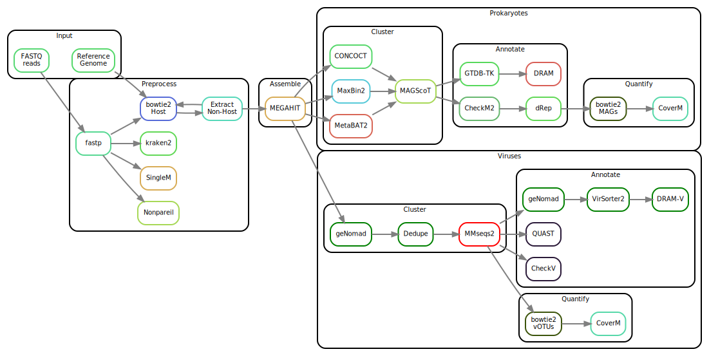

# Snakemake workflow: `Bioinfo_Macro_Genome_Resolved_Metagenomics`

A Snakemake workflow for Genome Resolved Metagenomics

## Usage
1. Make sure you have `conda`, `mamba` and `snakemake` installed.
    ```bash
    conda --version
    snakemake --version
    mamba --version
    ```

2. Clone the git repository in your terminal and get in:
    ```bash
    git clone git@github.com:3d-omics/Bioinfo_Macro_Genome_Resolved_Metagenomics.git
    cd Bioinfo_Macro_Genome_Resolved_Metagenomics
    ```

3. Test your installation by running the test data. It will download all the necesary software through conda / mamba. It should take less than 5 minutes.
    ```bash
    ./run
    ```

4. Run it with your own data:

   1. Edit `config/samples.tsv` and add your samples names, a library identifier to differentiate them, where are they located, the adapters used, and the coassemblies each sample will belong to. If no adapters are specified, they are asumed to be the current Nextera ones: `AGATCGGAAGAGCACACGTCTGAACTCCAGTCA` and `AGATCGGAAGAGCGTCGTGTAGGGAAAGAGTGT` for forward and reverse, respectively.

    ```tsv
    sample_id	library_id	forward_filename	reverse_filename	forward_adapter	reverse_adapter	assembly_ids
    sample1	lib1	resources/reads/sample1_1.fq.gz	resources/reads/sample1_2.fq.gz			sample1, all
    sample2	lib1	resources/reads/sample1_2.fq.gz	resources/reads/sample1_1.fq.gz			all
    ```

    2. Edit `config/features.yml` with reference databases:

    ```yaml
    host:
      fasta: resources/reference/chicken_39_sub.fa.gz

    magscot:
      pfam_hmm: workflow/scripts/MAGScoT/hmm/gtdbtk_rel207_Pfam-A.hmm.gz
      tigr_hmm: workflow/scripts/MAGScoT/hmm/gtdbtk_rel207_tigrfam.hmm.gz

    dram_database: "resources/mock_dram_db"
    gtdbtk_database: "resources/mock_gtdbtk_db"
    singlem_database: "resources/mock_singlem_db"
    kraken2_database: "resources/kraken2_mock"
    ```

    3. Edit `config/params.yml` with execution parameters. The defaults are reasonable.


5. Run the pipeline
     ```
     snakemake --use-conda --jobs 8 all
     #(slurm users), there is a script called run_slurm in the cloned directory that you can directly use to launch the pipeline on a slurm         cluster, you can modify the parameters or direclty execute it as it is
     ./run_slurm
     ```


## Rulegraph



## Features
- FASTQ processing with `fastp`.
- mapping of preprocessed reads against the host with `bowtie2`.
- assembly of non-host reads with `megahit`.
- binning with CONCOCT, Maxbin2, MetaBAT2, and aggregated with MAGScoT.
- coverage evaluation with `coverm`.


## Optional steps

The latest stages of the pipeline are CPU and RAM intensive, so not all steps are run by default. To access them, you have to "add phrases" to snakemake:
- Preprocessing:
  - Nonpareil: `pre_eval_with_nonpareil`
  - SingleM: `pre_eval_with_singlem`
- Dereplication:
  - dRep + CoverM: `dereplicate_eval`
  - dRep + DRAM + GTDB-Tk: `dereplicate_eval_with_dram`

Example:

```bash
snakemake --jobs 40 --use-conda all pre_eval_with_non_pareil
# (same for ./run and ./run_slurm ; all stands for the core pipeline)
```


## References

- [`fastp`](https://github.com/OpenGene/fastp)
- [`kraken2`](https://github.com/DerrickWood/kraken2)
- [`SingleM`](https://github.com/wwood/singlem)
- [`Nonpareil`](https://github.com/lmrodriguezr/nonpareil)
- [`bowtie2`](https://github.com/BenLangmead/bowtie2)
- [`samtools`](https://github.com/samtools/samtools)
- [`MEGAHIT`](https://github.com/voutcn/megahit)
- [`CONCOCT`](https://github.com/BinPro/CONCOCT)
- [`MaxBin2`](http://downloads.jbei.org/data/microbial_communities/MaxBin/MaxBin.html)
- [`MetaBat2`](https://bitbucket.org/berkeleylab/metabat)
- [`MAGScoT`](https://github.com/ikmb/MAGScoT)
- [`dRep`](https://github.com/MrOlm/drep)
- [`QUAST`](https://github.com/ablab/quast)
- [`GTDB-Tk`](https://github.com/Ecogenomics/GTDBTk)
- [`DRAM`](https://github.com/WrightonLabCSU/DRAM)
- [`CoverM`](https://github.com/wwood/CoverM)
- [`FastQC`](https://github.com/s-andrews/FastQC)
- [`multiqc`](https://github.com/ewels/MultiQC)
